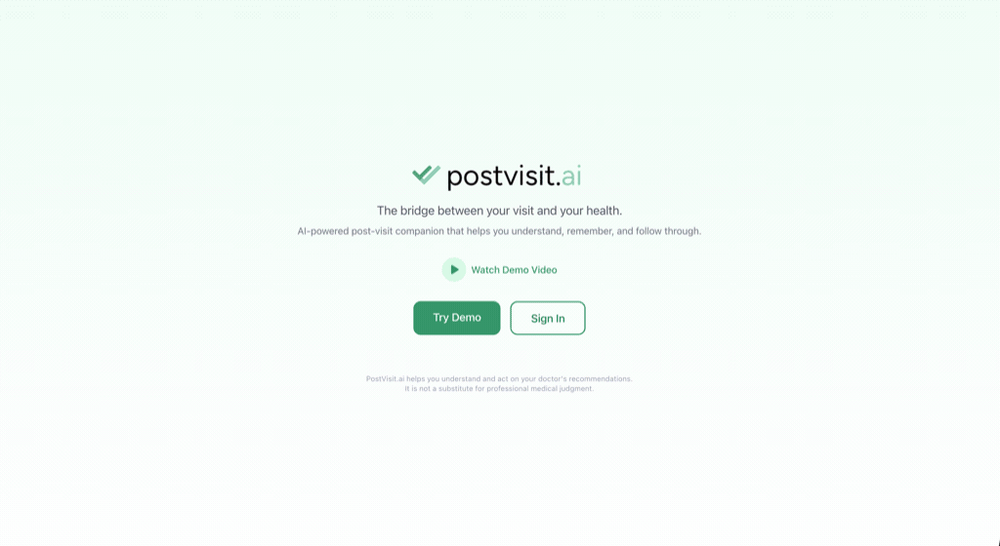
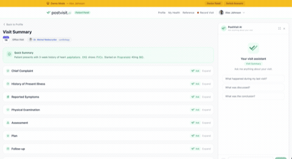
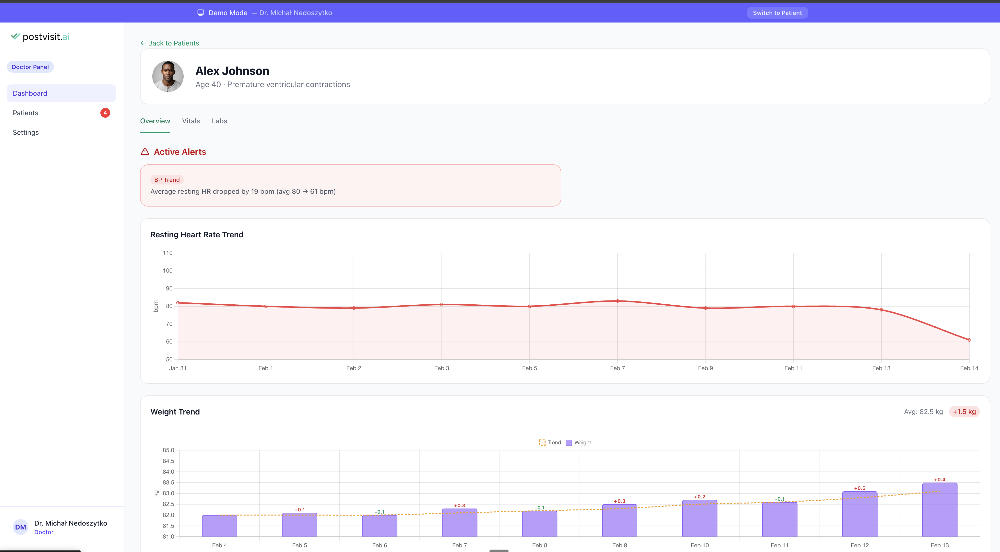
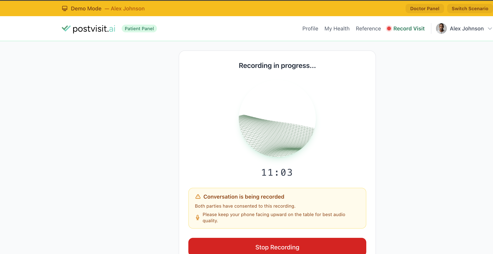
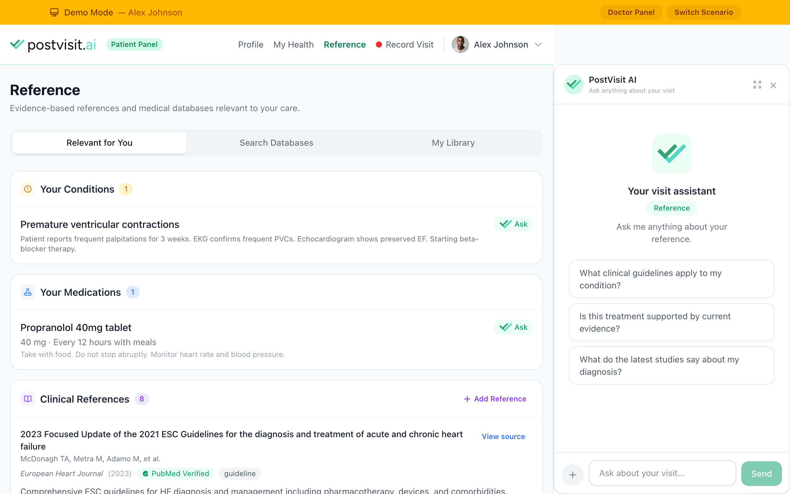

# PostVisit.ai

[]()
[]()
[]()
[]()
[]()
[](LICENSE)

**AI-powered post-visit care platform** that bridges the gap between the doctor's office and everything that comes after. Built with [Opus 4.6](#built-with-opus-46) for the [Claude Code hackathon](https://cerebralvalley.ai/e/claude-code-hackathon/details) (Feb 10-16, 2026).

**How it was built:** 349 commits in 7 days, **coded by a cardiologist from Brussels to a transatlantic flight to San Francisco**, tested in real hospital setting. [Read the full build log](BUILD-LOG.md).

**Watch Demo Video: [https://youtu.be/V29UCOii2jE](https://youtu.be/V29UCOii2jE)**

**Live Demo: [https://postvisit.ai](https://postvisit.ai)**

## The Problem

A medical visit packs dense, critical information into a short window — diagnoses, treatment plans, medication changes, follow-up instructions. Research shows that the more information provided, the lower the proportion patients retain ([Kessels, PMC 2003](https://pmc.ncbi.nlm.nih.gov/articles/PMC539473/)). Patients leave with unfamiliar terminology, no way to revisit what was discussed, and discharge papers that raise more questions than they answer. Doctors spend time repeating explanations and have no visibility into whether patients understood.

PostVisit.ai closes this loop. It preserves the full context of a clinical visit, gives patients an AI assistant to understand it on their own terms, and opens a communication channel back to the doctor -- bridging the gap between visits with grounded, visit-specific information instead of generic search results.

### Screenshots

<table>
  <tr>
    <td align="center"><strong>App Overview</strong></td>
    <td align="center"><strong>Visit Summary & AI Companion</strong></td>
  </tr>
  <tr>
    <td></td>
    <td></td>
  </tr>
  <tr>
    <td align="center" colspan="2">
      <table>
        <tr>
          <td align="center"><strong>Doctor Dashboard</strong></td>
          <td align="center"><strong>Reverse AI Scribe</strong></td>
          <td align="center"><strong>Evidence-Based References</strong></td>
        </tr>
        <tr>
          <td></td>
          <td></td>
          <td></td>
        </tr>
      </table>
    </td>
  </tr>
</table>

## What It Does

### Core AI Pipeline

- **Reverse AI Scribe** -- Patient records the visit (with consent). Audio is saved, transcribed, and combined into a structured clinical note. Supports long consultations via automatic chunking.
- **AI Visit Summary** -- Transcription processed into structured SOAP notes with full clinical context: health record, vitals, lab results, and evidence-based medicine references.
- **Contextual Q&A** -- Patient asks questions in natural language; gets answers grounded in their visit data, clinical guidelines, and FDA safety data. Clinical reasoning pipeline with tool use for real-time medication lookups and evidence-based citations.
- **Document AI Analysis** -- Upload medical documents (lab results, prescriptions, imaging reports) for AI-powered analysis with structured extraction. QR code mobile upload from phone camera.
- **Evidence-Based Medicine Library** -- Personal medical library with curated clinical guidelines, PubMed articles, and patient documents. AI analyzes each item and incorporates it into conversation context.
- **Medication Intelligence** -- Drug interaction checks (RxNorm), adverse events (OpenFDA FAERS), official drug labels (DailyMed), and dosage explanations -- all called as AI tools in real time.
- **Escalation Detection** -- AI monitors for urgent symptoms (chest pain, breathing difficulty, suicidal ideation) with thinking-backed evaluation and emergency service redirection.

### Doctor & Patient Loop

- **Doctor Dashboard** -- Monitor patient engagement, review AI chat transcripts, respond to escalations, trigger follow-up reminders and education materials.
- **Patient-Doctor Messaging** -- Patients send follow-up questions; doctors receive alerts for concerning patterns.
- **Patient Education Generator** -- AI-generated personalized education documents using tool use to pull real medication data and clinical guidelines.

### Additional Features

Medical term explain (click any term for plain-language explanation), AI tier selection (Quick/Balanced/Deep Analysis with adaptive thinking), multi-scenario demo engine (12 clinical scenarios across cardiology, endocrinology, gastroenterology, pulmonology), and showcase presentation views.

## Healthcare-Oriented Design

This is a hackathon demo running on public infrastructure. In production, PostVisit.ai is designed to run on a dedicated private cloud with no public AI endpoints. The architecture reflects this from day one:

- **AI endpoints behind authentication** -- All LLM-facing routes (`/chat`, `/explain`, `/education`) require Sanctum auth, role verification, and per-user rate limiting. No anonymous AI access.
- **External file storage** -- Patient uploads (audio recordings, documents) are stored on S3-compatible object storage, not on the application server. In production, this maps to a HIPAA-eligible storage provider.
- **HIPAA-inspired audit trail** -- Every access to patient data is logged: user, action, resource type, IP, PHI element categories. Exportable for compliance review.
- **FHIR-aligned data model** -- UUID primary keys, standard resource types (Patient, Encounter, Observation, Condition, MedicationRequest), designed for EHR integration.
- **Role-based access control** -- Patient, doctor, and admin roles with middleware guards. Doctors see only their patients.
- **Patient consent model** -- Visit recording requires explicit consent acknowledgment before audio capture begins.
- **No real patient data** -- All demo scenarios use fictional patients with AI-generated portraits and synthetic clinical data.

## Architecture

```
PostVisit.ai
+-- Laravel 12 (PHP 8.4)              API + backend logic
+-- Vue 3 + Tailwind CSS               Patient & Doctor SPA
+-- Claude Opus 4.6                    AI engine (streaming SSE)
+-- PostgreSQL 17                      Primary database (UUID, jsonb)
+-- OpenFDA + DailyMed + RxNorm        Drug safety data (public domain)
+-- NIH Clinical Tables               Condition/procedure lookup
+-- Laravel Sanctum                    Cookie + token auth
```

**Key design decisions:**
- Integrated Laravel + Vue (no CORS, shared auth) for hackathon speed
- UUID primary keys on all tables for FHIR compatibility
- FHIR-aligned data model (Patient, Encounter, Observation, Condition, MedicationRequest)
- Server-Sent Events (SSE) for real-time AI streaming
- AI prompts versioned as files in `prompts/` directory
- 5-layer AI context assembly: visit data, patient record, clinical guidelines, medications, FDA safety data
- Clinical reasoning pipeline with tool use: AI can call medication lookup, interaction checks, guideline retrieval, and adverse event queries in real time
- Three AI tiers (Quick/Balanced/Deep) with adaptive thinking budget
- All patient data is patient-owned (consent model, right to erasure)

## Tech Stack

| Component | Technology | License |
|-----------|-----------|---------|
| Backend | Laravel 12, PHP 8.4 | MIT |
| Frontend | Vue 3, Vue Router, Pinia | MIT |
| AI | Claude Opus 4.6 (Anthropic SDK) | Proprietary API |
| Database | PostgreSQL 17 | PostgreSQL License |
| CSS | Tailwind CSS | MIT |
| Auth | Laravel Sanctum | MIT |
| Drug Data | RxNorm (NLM) | Public Domain |
| Drug Safety | OpenFDA FAERS | Public Domain |
| Drug Labels | DailyMed (NLM) | Public Domain |
| Clinical Tables | NIH Clinical Tables | Public |
| Guidelines | ESC Clinical Guidelines | CC-BY |

Full license tracking: [`docs/licenses.md`](docs/licenses.md)

## Built with Opus 4.6

Every AI feature in PostVisit.ai leverages a specific Opus 4.6 capability:

| Opus 4.6 Feature | How PostVisit.ai Uses It |
|-------------------|--------------------------|
| **Extended Thinking** | Per-subsystem thinking budgets (1K-16K tokens). Chat, escalation detection, clinical reasoning, and transcript processing each get calibrated budgets. Adaptive effort routing adjusts thinking depth per question complexity. |
| **1M Context Window** | 8-layer context assembly loads the full clinical picture: SOAP note + transcript + patient history + vitals + medications + FDA safety data + clinical guidelines (full-text PMC articles) + personal medical library. Typical: 60K-180K tokens per request. |
| **Tool Use** | Agentic loop with 5 medical tools: drug interaction checks (RxNorm), drug safety info (OpenFDA/DailyMed), lab reference ranges, guideline search, adverse event queries. AI decides which tools to call during patient education generation and clinical reasoning. |
| **Prompt Caching** | System prompts and clinical guidelines cached with 5-minute TTL using `CacheControlEphemeral`. 78% reduction in input token costs for multi-message conversations. |
| **Streaming (SSE)** | Discovered a buffering bug in the Anthropic PHP SDK where PSR-18 clients buffer the entire response before returning. Built a raw cURL streaming layer for true token-by-token SSE delivery. Separate channels for thinking and response text give patients transparency into AI reasoning. |
| **Safety** | Thinking-backed escalation detection: Opus reasons through patient context before classifying urgency. Plan-Execute-Verify pipeline validates clinical responses against evidence. |

### 3-Tier Comparison Architecture

```
                    Good (Sonnet)    Better (Opus)    Opus 4.6 (Full)
Extended Thinking:       No           Chat+Scribe      All subsystems
Clinical Guidelines:     None         None             Full-text PMC
Escalation Detection:    Keywords     Keywords+AI      Keywords+AI+Thinking
Clinical Reasoning:      No           No               Plan-Execute-Verify
Thinking Budget:         0            16K tokens       34K tokens
```

Switching tiers in real-time during the demo shows the progressive improvement in reasoning depth, response quality, and safety detection. Full technical deep-dive with code examples: [`docs/opus-4.6-deep-dive.md`](docs/opus-4.6-deep-dive.md)

## Quick Start

### Prerequisites
- PHP 8.4, Composer
- PostgreSQL 17
- Bun (or npm)
- Laravel Herd (recommended) or any local PHP server
- Anthropic API key

### Setup

```bash
# Clone and install
git clone https://github.com/mnedoszytko/postvisit.git && cd postvisit
composer install
bun install

# Configure environment
cp .env.example .env
php artisan key:generate
# Edit .env: set DB_CONNECTION=pgsql, DB_DATABASE=postvisit
# Edit .env: set ANTHROPIC_API_KEY=sk-ant-...

# Database
php artisan migrate
php artisan db:seed --class=DemoSeeder

# Build frontend
bun run build
```

### Docker Setup

```bash
# 1. Configure environment — copy and edit .env
cp .env.example .env.docker
# Edit .env.docker and set at minimum:
#   APP_KEY=        (generate with: php artisan key:generate --show)
#   DB_HOST=db
#   DB_PORT=5432
#   DB_DATABASE=postvisit
#   DB_USERNAME=postgres
#   DB_PASSWORD=secret
#   ANTHROPIC_API_KEY=sk-ant-...   (required for AI chat features)

# 2. Start all services (app, nginx, postgres, queue worker)
docker compose up -d

# 3. Run migrations and seed demo data
docker compose exec app php artisan migrate --force
docker compose exec app php artisan db:seed --class=DemoSeeder
```

The app will be available at **http://localhost:8080**. Four services run: PHP-FPM, nginx, PostgreSQL 17, and a queue worker. AI chat features require a valid `ANTHROPIC_API_KEY`.

### Demo

The live demo at [postvisit.ai](https://postvisit.ai) is publicly accessible — no login required. The demo auto-authenticates and includes multiple clinical scenarios (cardiology, orthopedics, neurology, dermatology) with a scenario picker to switch between them. AI endpoints are rate-limited (10 req/min, 500/day global budget) to prevent abuse.

For local development, seed demo data with `php artisan db:seed --class=DemoSeeder`. Default accounts: `patient@demo.postvisit.ai` / `doctor@demo.postvisit.ai` (password: `password`).

### API Quick Test

```bash
# Start demo session (no auth required in local env)
curl -X POST http://postvisit.test/api/v1/demo/start

# Or login directly
curl -X POST http://postvisit.test/api/v1/auth/login \
  -H "Content-Type: application/json" \
  -d '{"email":"patient@demo.postvisit.ai","password":"password"}'
```

## API

111 REST endpoints under `/api/v1/`. Key modules:

| Module | Endpoints | Description |
|--------|-----------|-------------|
| Auth | 4 | Register, login, logout, profile |
| Patients | 11 | Profile, update, visits, conditions, health record, observations, documents, prescriptions |
| Documents | 6 | Show, download, thumbnail, AI analysis, reanalyze, delete |
| Practitioners | 2 | List and create practitioners |
| Visits | 3 | Create, view, summary |
| Transcripts | 9 | Upload text, upload audio, save chunk, transcribe chunk, start processing, view, process, status, audio playback |
| Chat (SSE) | 2 | AI Q&A with streaming, history |
| Explain (SSE) | 1 | Medical term explanation with streaming |
| Education | 1 | AI-generated patient education with tool use |
| Observations | 2 | List and detail (visit-scoped) |
| Prescriptions | 1 | Visit prescriptions |
| Medications | 5 | Search, detail, interactions, adverse events, labels |
| Medical Lookup | 4 | NIH conditions, drugs, procedures, DailyMed labels |
| References | 4 | Medical references index, detail, verify, PubMed verify |
| Feedback | 3 | Patient messages, doctor replies, mark read |
| Doctor | 13 | Dashboard, alerts, patients, visits, engagement, chat audit, observations, notifications, reply, inquire, quick actions |
| Audit | 2 | HIPAA-compliant audit logs, export |
| Settings | 3 | AI tier selection, feature flags |
| Library | 6 | Personal medical library: list, upload, URL import, detail, status, delete |
| Upload Tokens | 2 | QR code mobile upload tokens, status polling |
| Demo | 10 | Quick-start, status, reset, simulate alerts, scenario list, photos, animations, start scenario, switch role |

## AI Architecture

15 AI services in `app/Services/AI/`:
- **QaAssistant** -- Streaming Q&A with escalation detection and adaptive thinking
- **ClinicalReasoningPipeline** -- Plan-Execute-Verify with tool use orchestration
- **ToolExecutor** -- Executes AI tool calls (drug info, interactions, adverse events, guidelines)
- **MedicalExplainer** -- Term-level explanations in patient context
- **PatientEducationGenerator** -- Generates personalized education documents with tool use
- **DocumentAnalyzer** -- AI-powered analysis of uploaded medical documents
- **LibraryItemAnalyzer** -- Analyzes saved articles and URLs for the medical library
- **ScribeProcessor** -- Processes visit transcripts into structured SOAP notes
- **TermExtractor** -- Extracts and classifies medical terms from visit notes
- **EscalationDetector** -- Keyword + AI urgency evaluation with thinking-backed safety
- **SessionSummarizer** -- Summarizes chat sessions for doctor review
- **AiTierManager** -- Routes requests to Good/Better/Opus 4.6 tiers
- **ContextAssembler** -- 8-layer context builder for the 1M context window
- **PromptLoader** -- Loads versioned prompts from `prompts/` directory
- **AnthropicClient** -- Low-level Anthropic API client with streaming + thinking support

## Testing

```bash
php artisan test
```

262 feature tests covering all API modules with 797 assertions. Tests use SQLite in-memory for speed, with mocked AI services.

## Project Structure

```
app/
+-- Http/Controllers/Api/     # 21 API controllers
+-- Http/Middleware/           # RoleMiddleware (doctor/admin guards)
+-- Models/                   # 22 Eloquent models (UUID, FHIR-aligned)
+-- Services/AI/              # 15 AI services (prompts, context, streaming, tool use)
+-- Services/Medications/     # RxNorm, OpenFDA, DailyMed, NIH, PubMed clients
+-- Services/Stt/             # Speech-to-text (Whisper)
database/
+-- factories/                # 19 model factories for testing
+-- migrations/               # 35 migrations (PostgreSQL-optimized)
+-- seeders/                  # DemoSeeder + DemoScenarioSeeder (multi-scenario)
resources/js/
+-- views/                    # 26 Vue views (patient + doctor + showcase)
+-- components/               # 31 Vue components (ChatPanel, VisitSection, health/*, etc.)
+-- stores/                   # 6 Pinia stores (auth, visit, chat, doctor, toast, settings)
+-- composables/              # useApi.ts, useChatBus.js
+-- layouts/                  # PatientLayout, DoctorLayout
+-- router/                   # Vue Router with role-based guards
docs/                         # 35 documentation files
prompts/                      # 14 AI system prompts (versioned)
demo/                         # Demo data, scenarios, patient photos, animations
```

## Documentation

- [`docs/api.md`](docs/api.md) -- Full API documentation (96 endpoints)
- [`docs/architecture.md`](docs/architecture.md) -- System architecture and data flow
- [`docs/prd.md`](docs/prd.md) -- Product Requirements Document
- [`docs/data-model.md`](docs/data-model.md) -- Database schema and relationships
- [`docs/decisions.md`](docs/decisions.md) -- Architecture decision log
- [`docs/ai-prompts.md`](docs/ai-prompts.md) -- AI prompt documentation and versioning
- [`docs/licenses.md`](docs/licenses.md) -- Dependency license tracker
- [`docs/healthcare-compliance.md`](docs/healthcare-compliance.md) -- **HIPAA, GDPR, and FHIR compliance**
- [`docs/security-audit.md`](docs/security-audit.md) -- OWASP Top 10 security audit
- [`docs/demo-guide.md`](docs/demo-guide.md) -- Step-by-step demo walkthrough
- [`docs/demo-scenarios.md`](docs/demo-scenarios.md) -- Demo scenario definitions
- [`docs/deployment.md`](docs/deployment.md) -- Production deployment guide
- [`docs/clinical-sources.md`](docs/clinical-sources.md) -- Clinical data sources and guidelines
- [`docs/opus-4.6-deep-dive.md`](docs/opus-4.6-deep-dive.md) -- **Opus 4.6 deep dive with code examples**
- [`docs/opus-4.6-usage.md`](docs/opus-4.6-usage.md) -- Opus 4.6 feature usage and rationale
- [`docs/KEEP-THINKING.md`](docs/KEEP-THINKING.md) -- Clinical depth iteration log
- [`docs/lessons.md`](docs/lessons.md) -- Development lessons learned

## Author

Built by **[Michal Nedoszytko, MD PhD](https://nedoszytko.com)** -- practicing cardiologist, software engineer, and AI in medicine educator with 20+ years of experience building software for healthcare. Designed, architected, and developed as a solo project. "PostVisit Agent" in git history represents Claude Code automated sessions (CI tasks, nightly runs). See [AUTHORS.md](AUTHORS.md) for links and bio, and [BUILD-LOG.md](BUILD-LOG.md) for the full 6-day build log with clinical testing notes.

## Hackathon Tracks

PostVisit.ai addresses all three hackathon tracks:

1. **Build a Tool That Should Exist** -- No existing system combines visit context, health records, and clinical guidelines for patient-initiated post-visit support
2. **Break the Barriers** -- AI translates expert medical knowledge into accessible language for any patient, regardless of health literacy
3. **Amplify Human Judgment** -- Doctor-in-the-loop design: the system helps patients understand clinical decisions, never replaces them

## Disclaimer

All clinical scenarios, patient profiles, medical records, and health data displayed in this application are entirely fictional, created for demonstration purposes only, and do not depict any real person or actual medical encounter.

## License

MIT License. See [LICENSE](LICENSE) for details.

## Security

See [SECURITY.md](SECURITY.md) for security policies and responsible disclosure.
