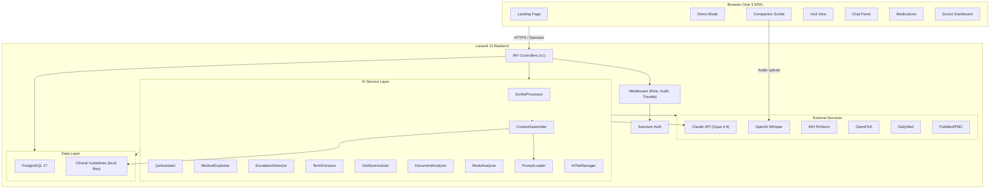
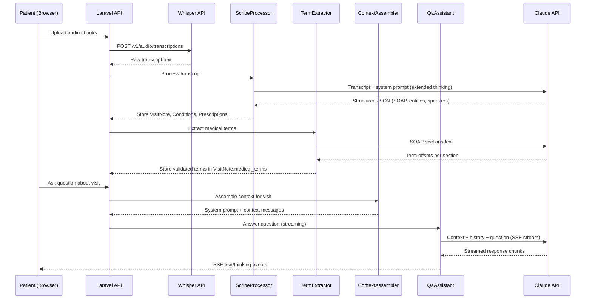
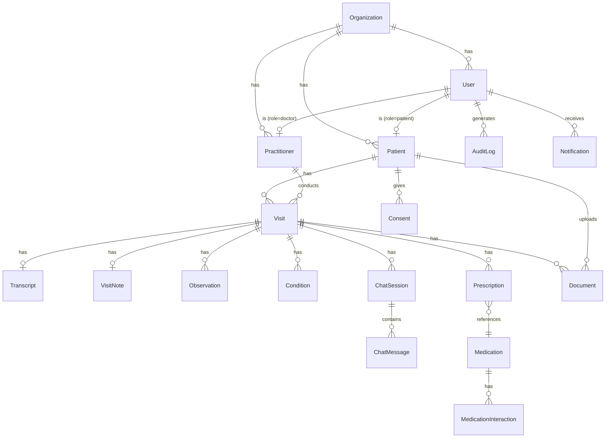
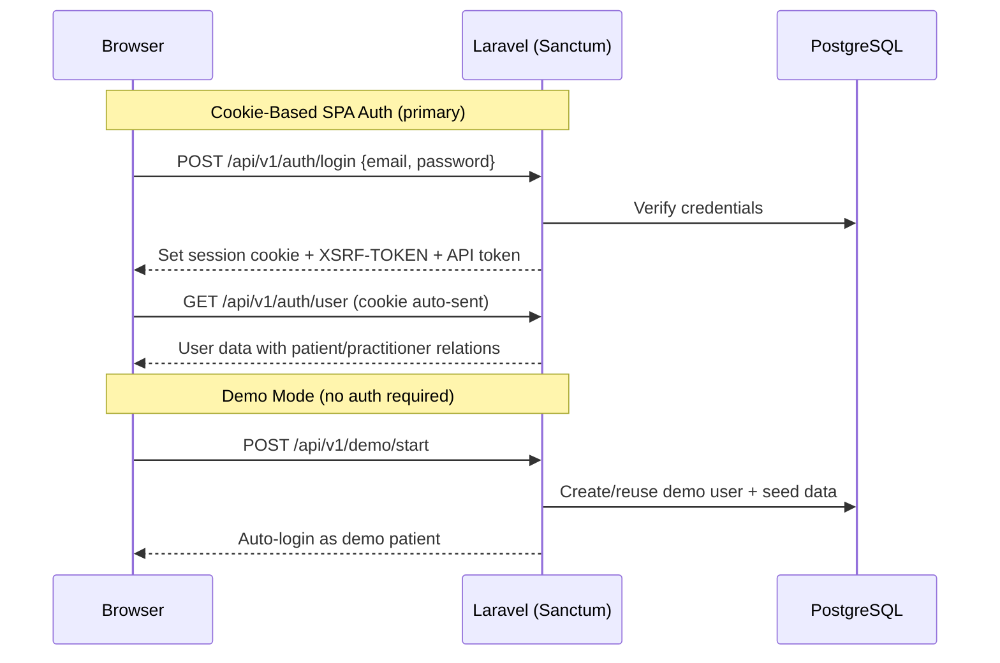

# System Architecture

PostVisit.ai is a clinical context-aware AI assistant that helps patients understand and act on their medical visits after leaving the doctor's office. This document describes the system architecture, data flow, and key technical decisions.

## High-Level Architecture



## Data Flow: Recording to Q&A

The core pipeline transforms a raw clinical encounter into structured data that powers the patient-facing AI assistant.



### Pipeline Stages

1. **Recording** -- The Companion Scribe (`CompanionScribe.vue`) records audio in the browser using the MediaRecorder API. Audio chunks are uploaded to the server as they are captured, ensuring no data is lost if the browser closes.

2. **Transcription** -- Audio files are sent to the OpenAI Whisper API for speech-to-text conversion. The `WhisperProvider` service handles the API call and returns plain text.

3. **Scribe Processing** -- The `ScribeProcessor` sends the raw transcript to Claude with the `scribe-processor` system prompt. Using extended thinking (Opus 4.6 tier), Claude produces structured JSON containing:
   - Clean transcript with speaker labels
   - SOAP note (Subjective, Objective, Assessment, Plan)
   - Extracted clinical entities (diagnoses, medications, procedures)
   - Speaker identification

4. **Term Extraction** -- The `TermExtractor` analyzes each SOAP section to identify medical terms with character offsets. These offsets enable tap-to-explain highlighting in the frontend. Offsets are validated server-side (checking that the substring at the claimed position matches the term) with a fallback text-search strategy.

5. **Context Assembly** -- The `ContextAssembler` builds a multi-layered context for every AI call:
   - **Layer 0 (System):** Versioned system prompt from `prompts/` directory + clinical guidelines (cacheable via Anthropic prompt caching)
   - **Layer 1 (Visit):** SOAP note, transcript, observations, test results
   - **Layer 2 (Patient):** Demographics, conditions, current medications
   - **Layer 3 (Medications):** Dosing, route, indications, special instructions
   - **Layer 4 (FDA Safety):** Adverse event reports and label data from OpenFDA

6. **Q&A** -- The `QaAssistant` streams answers to patient questions using SSE (Server-Sent Events). The full assembled context, conversation history, and the new question are sent to Claude. Extended thinking is used on the Opus 4.6 tier for deeper clinical reasoning before the visible response.

## AI Service Layer

All AI logic lives in `app/Services/AI/`. Controllers never call the Anthropic API directly.

| Service | Purpose | Prompt File | Streaming |
|---------|---------|-------------|-----------|
| `ScribeProcessor` | Transcript to structured SOAP + entities | `scribe-processor.md` | No |
| `QaAssistant` | Patient Q&A about their visit | `qa-assistant.md` | Yes (SSE) |
| `MedicalExplainer` | Tap-to-explain for medical terms | `medical-explainer.md` | Yes (SSE) |
| `EscalationDetector` | Urgency triage (keyword + AI) | `escalation-detector.md` | No |
| `TermExtractor` | Medical term identification with offsets | `term-extractor.md` | No |
| `VisitSummarizer` | Patient-friendly visit summary | `visit-summarizer.md` | No |
| `DocumentAnalyzer` | Medical document analysis (vision) | `document-analyzer.md` | No |
| `MedsAnalyzer` | Medication interaction analysis | `meds-analyzer.md` | No |
| `ContextAssembler` | Multi-layer context builder | N/A (orchestrator) | N/A |
| `PromptLoader` | Loads versioned prompts from `prompts/` | N/A (utility) | N/A |
| `AiTierManager` | Manages AI tier selection (Opus/Sonnet/Haiku) | N/A (config) | N/A |
| `AnthropicClient` | Low-level Claude API wrapper | N/A (client) | Yes |
| `VisitStructurer` | Visit data structuring | `visit-structurer.md` | No |

### Prompts as Code

System prompts are stored as Markdown files in the `prompts/` directory, loaded at runtime by the `PromptLoader` service. This approach makes prompts:
- **Versioned** in git alongside the code they support
- **Reviewable** in pull requests
- **Testable** (prompt changes are code changes)
- **Separated** from business logic (controllers and services never contain hardcoded prompt text)

### AI Tier System

The `AiTierManager` provides three quality tiers that control which Claude model, features, and thinking budgets are used:

| Tier | Model | Extended Thinking | Prompt Caching | Guidelines |
|------|-------|-------------------|----------------|------------|
| **Opus 4.6** | `claude-opus-4-6` | Yes (configurable budgets) | Yes | Yes |
| **Sonnet** | `claude-sonnet-4-5-20250929` | No | Yes | No |
| **Haiku** | `claude-haiku-4-5-20251001` | No | No | No |

Users can switch tiers in Settings to compare quality. The demo defaults to Opus 4.6 for maximum clinical depth.

### Escalation Safety

The `EscalationDetector` implements a two-stage urgency detection system:

1. **Fast path:** Keyword matching against critical symptom phrases (chest pain, difficulty breathing, suicidal ideation, etc.). Immediate response with no API call.
2. **AI evaluation:** For messages without critical keywords, Claude evaluates urgency considering the patient's known conditions and visit specialty. On the Opus 4.6 tier, extended thinking is used for clinical reasoning before the escalation decision.

Critical escalations bypass the normal Q&A flow entirely and return an emergency response directing the patient to call 911.

## Database Schema

PostgreSQL 17 with native UUID primary keys on all tables. Key models and relationships:



### Key Models (20 total)

| Model | Table | Purpose |
|-------|-------|---------|
| `User` | `users` | Authentication, role (patient/doctor/admin) |
| `Patient` | `patients` | Patient demographics, health profile (jsonb) |
| `Practitioner` | `practitioners` | Doctor profiles, specialties |
| `Organization` | `organizations` | Multi-tenant grouping |
| `Visit` | `visits` | Clinical encounter record |
| `Transcript` | `transcripts` | Raw + clean transcript, processing status |
| `VisitNote` | `visit_notes` | SOAP sections, medical_terms (jsonb) |
| `Observation` | `observations` | Lab results, vitals (FHIR-inspired) |
| `Condition` | `conditions` | Diagnoses with ICD-10 codes |
| `Prescription` | `prescriptions` | Active medications with dosing |
| `Medication` | `medications` | Drug master data (RxNorm codes) |
| `MedicationInteraction` | `medication_interactions` | Drug-drug interaction records |
| `Document` | `documents` | Uploaded files (images, PDFs) with AI analysis |
| `ChatSession` | `chat_sessions` | Conversation container per visit |
| `ChatMessage` | `chat_messages` | Individual messages in a chat |
| `AuditLog` | `audit_logs` | Access and action logging |
| `Consent` | `consents` | Patient consent records |
| `Notification` | `notifications` | Alerts for doctors/patients |
| `UploadToken` | `upload_tokens` | QR-code-based mobile upload tokens |
| `MedicalReference` | `medical_references` | PubMed/PMC reference citations |

All models use Laravel's `HasUuids` trait for UUID primary keys stored as PostgreSQL native `uuid` type.

## Authentication Flow



PostVisit.ai uses **Laravel Sanctum** in stateful (cookie-based) SPA mode. The Vue frontend runs on the same origin as the Laravel backend, eliminating CORS complexity. Key aspects:

- **Stateful sessions** via `statefulApi()` middleware -- cookies carry authentication automatically
- **XSRF protection** -- Laravel sets an `XSRF-TOKEN` cookie; axios sends it back as `X-XSRF-TOKEN` header
- **API tokens** -- also issued at login for programmatic/mobile access
- **Role-based access** -- `RoleMiddleware` gates doctor endpoints (dashboard, patient list, audit)
- **Demo bypass** -- `/api/v1/demo/*` endpoints require no auth for easy hackathon demo access

## Frontend Architecture

### Stack
- **Vue 3** with Composition API and `<script setup>` syntax
- **Pinia** for state management
- **Vue Router** with role-based navigation guards
- **Tailwind CSS v4** for styling
- **Vite** for bundling (integrated in Laravel)

### Directory Structure

```
resources/js/
├── views/           # 17 page-level components
├── components/      # 19 reusable UI components
├── stores/          # 6 Pinia stores
├── composables/     # 3 composables (useApi, useAuth, useSse)
├── layouts/         # PatientLayout, DoctorLayout
├── router/          # Vue Router with auth guards
└── app.js           # Entry point
```

### Key Views

| View | Route | Description |
|------|-------|-------------|
| `Landing.vue` | `/` | Marketing landing page |
| `DemoMode.vue` | `/demo` | One-click demo entry |
| `ScenarioPicker.vue` | `/demo/scenarios` | Choose clinical scenario |
| `CompanionScribe.vue` | `/scribe` | Audio recording + transcription |
| `Processing.vue` | `/processing` | Transcript processing progress |
| `VisitView.vue` | `/visits/:id` | SOAP note with term highlighting + chat |
| `MedsDetail.vue` | `/visits/:id/meds` | Medication details + interactions |
| `HealthDashboard.vue` | `/health` | Patient health overview |
| `MedicalLibrary.vue` | `/library` | Browse medical references |
| `DoctorDashboard.vue` | `/doctor` | Doctor overview (alerts, patients) |
| `DoctorPatientDetail.vue` | `/doctor/patients/:id` | Doctor view of a patient |
| `Settings.vue` | `/settings` | AI tier selection |

### State Management (Pinia Stores)

| Store | Purpose |
|-------|---------|
| `auth` | User session, login/logout, role checks |
| `visit` | Current visit data, SOAP note, observations |
| `chat` | Chat messages, SSE streaming state |
| `doctor` | Doctor dashboard data, patient list, alerts |
| `settings` | AI tier preference |
| `toast` | Toast notification queue |

### Composables

| Composable | Purpose |
|------------|---------|
| `useApi` | Axios wrapper with auth headers, error handling |
| `useAuth` | Reactive auth state, guard helpers |
| `useSse` | SSE connection management for AI streaming |

### Key UI Components

- **`HighlightedText.vue`** -- Renders SOAP sections with clickable medical term highlights. Uses character offsets from `TermExtractor` to wrap terms in interactive spans.
- **`TermPopover.vue`** -- Popover that appears on term tap, showing a brief definition and an "Explain" button that triggers the `MedicalExplainer` streaming call.
- **`ChatPanel.vue`** -- Real-time chat interface with SSE streaming, thinking indicators, and source chips.
- **`StreamingMessage.vue`** -- Renders an AI response as it streams in, with markdown rendering.
- **`ThinkingIndicator.vue`** -- Shows when Claude is using extended thinking (Opus 4.6 tier).
- **`MedCard.vue`** -- Medication card with dosing, warnings, and interaction indicators.
- **`VisitAttachments.vue`** -- Document upload area supporting images and PDFs via drag-and-drop or QR code mobile upload.

## External Service Integrations

| Service | Client Class | Purpose | Data |
|---------|-------------|---------|------|
| **Claude API** | `AnthropicClient` | All AI features | Q&A, SOAP, term extraction, explanations |
| **OpenAI Whisper** | `WhisperProvider` | Speech-to-text | Audio transcription |
| **NIH RxNorm** | `RxNormClient` | Drug normalization | Generic/brand names, RxCUI codes |
| **OpenFDA** | `OpenFdaClient` | Drug safety | Adverse events (FAERS), drug labels |
| **DailyMed** | `DailyMedClient` | Drug labeling | SPL drug label sections |
| **NIH ClinicalTables** | `NihClinicalTablesClient` | Medical lookup | Conditions, procedures search |
| **PubMed/PMC** | `PubMedClient` | Literature | Reference verification, article metadata |

### Clinical Guidelines (Local)

Bundled clinical guidelines from open-access sources (WikiDoc CC-BY-SA, DailyMed public domain) are stored in `demo/guidelines/` and loaded by the `GuidelinesRepository` service. On the Opus 4.6 tier, these are injected into the system prompt with Anthropic's prompt caching for efficient reuse across requests.

## Deployment Architecture

```
                    ┌──────────────┐
                    │   Cloudflare  │
                    │   (DNS + CDN) │
                    └──────┬───────┘
                           │
                    ┌──────▼───────┐
                    │   Hetzner     │
                    │   VPS         │
                    │               │
                    │  ┌──────────┐ │
                    │  │  Nginx   │ │
                    │  └────┬─────┘ │
                    │       │       │
                    │  ┌────▼─────┐ │
                    │  │ PHP-FPM  │ │
                    │  │ (8.4)    │ │
                    │  └────┬─────┘ │
                    │       │       │
                    │  ┌────▼─────┐ │
                    │  │PostgreSQL│ │
                    │  │   17     │ │
                    │  └──────────┘ │
                    └──────────────┘
```

- **Hosting:** Hetzner VPS managed by Laravel Forge
- **Web server:** Nginx with PHP-FPM 8.4
- **Database:** PostgreSQL 17 (jsonb, tsvector, native UUID support)
- **Cache/Queue:** PostgreSQL-backed (database driver for both)
- **Deployment:** Auto-deploy from `main` branch via Forge
- **Local dev:** Laravel Herd (PHP 8.4 isolated) with Vite HMR

## Security & Audit Logging

PostVisit.ai handles Protected Health Information (PHI) and implements a HIPAA-inspired audit trail to track every access to sensitive clinical data. This is not a checkbox exercise -- the audit system is designed so that a compliance officer could reconstruct exactly who accessed what patient data, when, and why.

### Audit Middleware (Terminable)

The `AuditMiddleware` (`app/Http/Middleware/AuditMiddleware.php`) is registered as a terminable middleware, meaning the audit record is written **after** the HTTP response has been sent to the browser. This ensures audit logging never adds latency to user-facing requests.

```
Request → Controller → Response sent → [AuditMiddleware::terminate()] → Write audit_logs row
```

The middleware is applied to all PHI-bearing route groups:
- **Patient data** -- profiles, conditions, prescriptions, observations, health records, documents
- **Visit data** -- visit details, summaries, SOAP notes, transcripts
- **AI interactions** -- chat sessions, medical term explanations
- **Medications** -- drug search, interactions, adverse events, labels
- **Medical references** -- literature lookup and verification
- **Doctor dashboard** -- patient lists, engagement stats, chat audit trails
- **Audit logs themselves** -- meta-audit (querying the audit log is itself audited)

Login and logout events are logged directly in `AuthController` to capture authentication lifecycle outside the middleware's scope.

### What Gets Logged

Each audit record captures:

| Field | Purpose |
|-------|---------|
| `user_id` | Who accessed the data (foreign key to `users`) |
| `user_role` | Role at time of access (`patient`, `doctor`, `admin`) |
| `action_type` | What they did: `create`, `read`, `update`, `delete`, `download`, `export`, `login`, `logout` |
| `resource_type` | What kind of data (e.g., `visit`, `transcript`, `medication`, `chat_session`) |
| `resource_id` | Specific record accessed (UUID) |
| `success` | Whether the request succeeded (HTTP status < 400) |
| `ip_address` | Client IP for forensic tracing |
| `session_id` | Session ID to correlate multiple actions in one session |
| `phi_accessed` | Boolean flag -- always `true` for audited routes |
| `phi_elements` | JSON array of specific PHI categories accessed (see below) |
| `accessed_at` | Timestamp of access |

### PHI Element Tracking

The middleware automatically classifies which categories of PHI are accessed based on the resource type, enabling fine-grained compliance reporting:

| Resource Type | PHI Elements |
|---------------|-------------|
| `visit` | `visit_data`, `clinical_notes` |
| `patient` / `patient_profile` | `demographics`, `contact_info` |
| `transcript` | `visit_recording`, `spoken_content` |
| `visit_note` | `soap_notes`, `clinical_assessment` |
| `chat_session` | `patient_questions`, `ai_responses` |
| `observation` | `lab_results`, `vitals` |
| `condition` | `diagnoses` |
| `medication` | `prescriptions`, `drug_info` |
| `health_summary` | `aggregate_health_data` |
| `document` | `clinical_documents` |
| `explanation` | `medical_explanations` |

### Action Type Resolution

HTTP methods map to action types automatically: `GET` = `read`, `POST` = `create`, `PUT/PATCH` = `update`, `DELETE` = `delete`. If the request includes `?download=true` or `?export=true` query parameters, the action is upgraded to `download` -- this distinction matters for compliance since data leaving the system (downloads/exports) carries higher risk than in-app viewing.

### Audit API

Doctors and admins can query audit logs via `GET /api/v1/audit/logs` with filters for `resource_type`, `user_id`, and `action_type`. The endpoint itself is audited (meta-audit). See [API Reference](api.md#audit) for full details.

### Database Indexing

The `audit_logs` table uses composite indices on `(user_id, accessed_at)` and `(resource_id, accessed_at)` for efficient time-range queries, plus a standalone index on `phi_accessed` for compliance-focused queries.

### Other Security Measures

- **No medical data in localStorage** -- all sensitive data stays server-side
- **Consent tracking** -- patient consent records stored in `consents` table
- **Role-based access** -- doctors see patient data only through authorized endpoints with `role:doctor,admin` middleware
- **CSRF protection** -- Sanctum's stateful middleware handles XSRF tokens automatically
- **Rate limiting** -- auth endpoints throttled, API endpoints use Laravel's built-in rate limiter
- **AI safety guardrails** -- `EscalationDetector` catches emergencies before AI responds; all AI outputs include medical disclaimers
